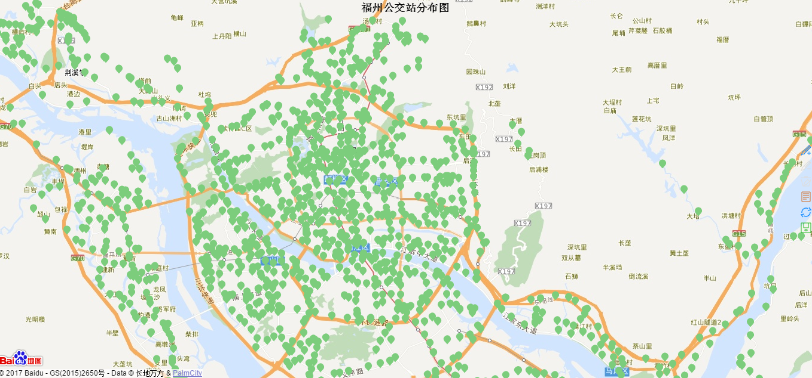
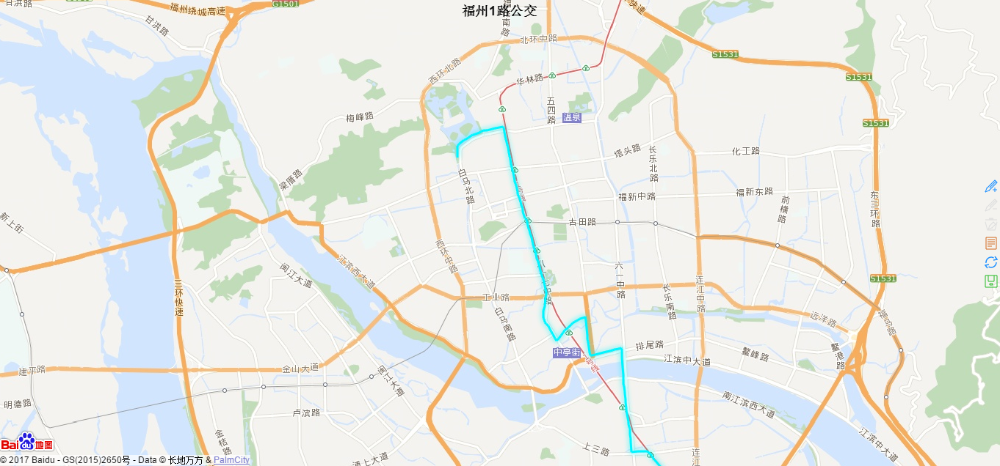
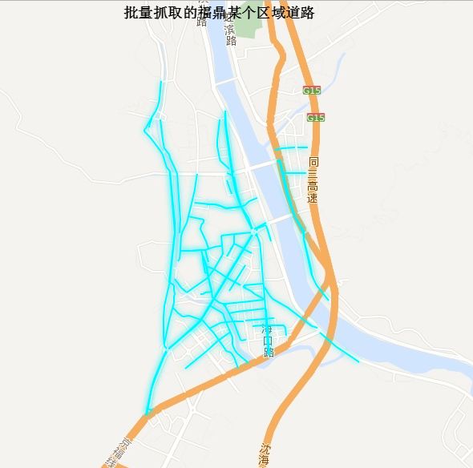
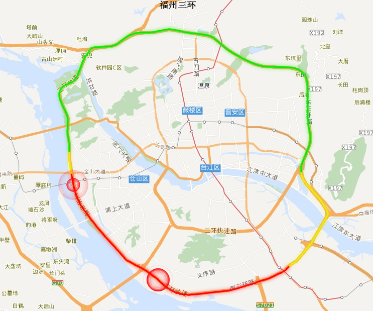
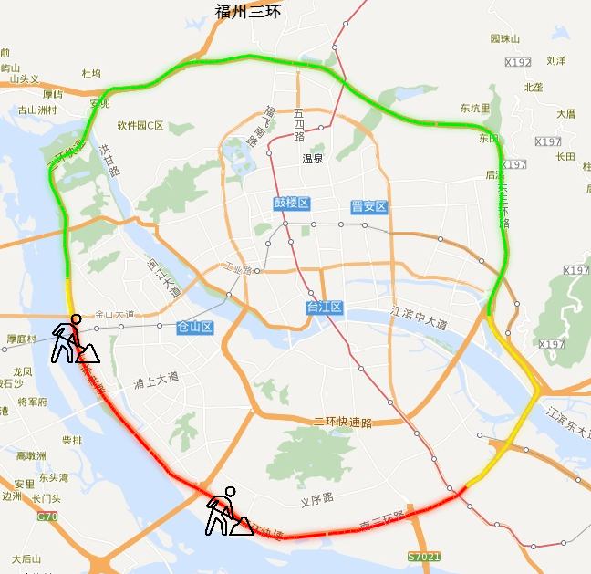
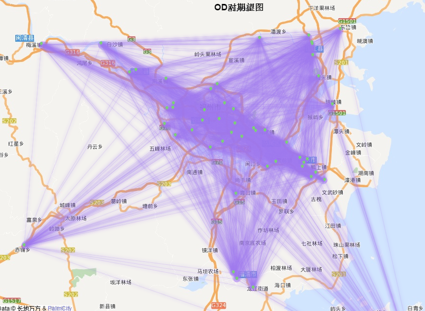

```{r setup, include=FALSE}
knitr::opts_chunk$set(echo = F,warning = F,fig.align='center')
library(REmap)
library(bamapr)
library(wordcloud2)
library(flexdashboard)
```

## 项目背景介绍
- web地图数据接口(API)  

 <http://lbs.amap.com/api/webservice/summary/>  
 
 <http://lbsyun.baidu.com/index.php?title=webapi>.

- web地图时效性、移植性强


- 图片的核心是数据


 - 数据处理步骤  
     + 数据抓取  
     + 数据清洗
     + 数据存储
     + 数据挖掘  
     + 可视化展示  

## 近期工作内容
- 批量抓取POI信息（如公交站点）
- 批量抓取公交路线
- 批量抓取路网信息（以福鼎为例）
- 批量抓取拥堵情况
- 叠加事故标志
- 叠加施工标志
- OD对期望图


## 批量抓取公交站点
公交站点:
```{r }
data(fzbus)
bus$name=paste(bus$name,bus$id,sep="")
pointData=data.frame(name=bus[,"name"],color="#7CCD7C")
geodata=bus[,c("lon_bd","lat_bd","name")]
# geodata$lon=as.numeric(geodata$lon)
# geodata$lat=as.numeric(geodata$lat)
#转换成百度地图
lonlat=data.frame(geoconv(geodata[c(1:2)]))
colnames(lonlat)=c("lon_bd","lat_bd")
bus=cbind(bus,lonlat)

remapB(center = get_city_coord("福州"),
       zoom = 14,
       title = "福州公交站分布图",
       color = "googlelite",
       markPointData = pointData,
       markPointTheme = markPointControl(symbol = 'pin',
                                         symbolSize = 5,
                                         effect = F),
       geoData = geodata)

cat("福州全市（含五区八县）共",nrow(bus),"个公交车站\n")
route=unlist(strsplit(bus$address,split = "[;/\\.]"))
route=route[!duplicated(route)]
route=route[-38]
route_dy=route[-grep(pattern = "停运",x = route)]
cat("福州全市（含五区八县）共",length(route_dy),"个公交线路\n")
```


## 公交路线
公交路线:
```{r }
cat("公交路线及其站点查询\n")
road="1路"
x=getBusRoute(keywords=road)
head(x)
ll=getBusRoute(keywords=road,getcoord=T,gettime=T)
cat("公交路线早晚班时间\n")
ll[[2]]
cat("公交路线路径地图\n")
y=ll[[3]]
y[1,1]=gsub(pattern = "\\]",replacement = "",x = y[1,1])
mtx=matrix(as.numeric(unlist(strsplit(y[1,1],split = ","))),ncol=2,byrow=T)
#转换为百度地图坐标
mtx=geoconv(geocode = mtx,from = 3, to = 5)
geodata=mtx2geoData(mtx,name = road)
#geodata先经度后维度
#col=rgb(red =252,green = 249,blue =0.5 )
linedata=mtx2lineData(mtx = mtx,name = road,color ="#00F5FF")


remapB(center = get_city_coord("福州"),
       zoom = 14,
       title = paste("福州",road,"公交",sep=""),
       color = "googlelite",

       markLineData =linedata,
       markLineTheme = markLineControl(smoothness = 0,lineWidth=3,
                                       effect = F,lineType = "solid",
                                       symbolSize = c(0,0)),
       geoData = geodata[,c(2,1,3)])
```


## 批量抓取路网信息
路网: 
```{r}
data(fds)
geoData1=na.omit(geoData1)

lineData1=na.omit(lineData1)
lineData1$color="#00F5FF"

remapB(center = get_city_coord("福鼎"),
       zoom = 15,
       title = "批量抓取的福鼎某个区域道路",
       color = "googlelite",
       markLineData = lineData1,
       markLineTheme = markLineControl(smoothness = 0,lineWidth=2,
                                       effect = F,lineType = "solid",
                                       symbolSize = c(0,0)),

       geoData = geoData1)
```


## 批量抓取拥堵情况
```{r fig.align='center',echo=TRUE}
data(trafficstatus)
df=trafficstatus[!trafficstatus$expedite=="100.00%",]
tra_list=list()
for(i in 1:nrow(df)){
        a=unlist(strsplit(df$description[i],split = "；"))
        tra_list[[i]]=data.frame(road=a,
        expedite=rep(df$expedite[i],length(a)),
        congested=rep(df$congested[i],length(a)),
        blocked  =rep(df$blocked  [i],length(a)),
        unknown  =rep(df$unknown  [i],length(a)),
        stringsAsFactors = F)
}
dfx=do.call(rbind,tra_list)
dfx$expedite=gsub(pattern = "\\%",replacement = "",x = dfx$expedite)
dfx$road=unlist(strsplit(dfx$road,split = "："))[seq(1, by = 2,length.out = nrow(dfx))]
dfx$expedite=100-as.numeric(dfx$expedite)
# cat("拥堵情况表：\n")
# head(dfx)
print(paste("路况监控时段",df$time[1],sep=""))

wordcloud2(dfx,size = 0.3)


```

- 最拥堵路段的拥堵占比
```{r,echo=TRUE}
index=which.min(dfx$expedite)
gauge(100-dfx[index,2], min = 0, max = 100, symbol = '%', gaugeSectors(
  success = c(0, 10), warning = c(11, 89), danger = c(90, 100)
))
```

## 叠加事故标志
叠加事故标志:


```{r }
data(fzdat)

set.seed(1234)
index=which(threeRing_n$line$color=="#FF0000")
pointData = data.frame(sample(threeRing_n$point$index[index],2),
                       color = c(rep("red",2)))
remapB(center = get_city_coord("福州"),
       zoom = 14,
       title = "福州三环",
       color = "googlelite",
       markPointData = pointData,
       markPointTheme = markPointControl(symbol = 'circle',
                                         symbolSize = 15,
                                         effect = T),
       markLineData = threeRing_n[[2]],
       markLineTheme = markLineControl(smoothness = 0,lineWidth=3,
                                       effect = F,lineType = "solid",
                                       symbolSize = c(0,0)),
       geoData = threeRing_n$point[c("Lon","Lat","index")])


```


## 叠加施工标志
叠加施工标志:
```{r}
data(fzdat)
set.seed(1234)
index=which(threeRing_n$line$color=="#FF0000")
pointData = data.frame(sample(threeRing_n$point$index[index],2),
                       color = c(rep("red",2)))
web_path="http://www.iconpng.com/png/ios7_icons/road_worker.png"
remapB(center = get_city_coord("福州"),
       zoom = 14,
       title = "福州三环",
       color = "googlelite",
       markPointData = pointData,
       markPointTheme = markPointControl(
           symbol = paste("image://",web_path,sep=""),
                                         symbolSize = 30,
                                         effect = F),
       markLineData = threeRing_n[[2]],
       markLineTheme = markLineControl(smoothness = 0,lineWidth=3,
                                       effect = F,lineType = "solid",
                                       symbolSize = c(0,0)),
       geoData = threeRing_n$point[c("Lon","Lat","index")])
```


## OD对期望图
OD对期望图:
```{r}
data(fzbus)
bus_sample=bus[sample(1:nrow(bus),size = 50,replace = F),]
c=matrix(rep(NA,nrow(bus_sample)^2),ncol=nrow(bus_sample))
colnames(c)=bus_sample$name
rownames(c)=bus_sample$name
c[is.na(c)]="#9F79EE"
library(reshape2)
lineData3=melt(c)
colnames(lineData3)=c("origin","destination","color")
pointData3=data.frame(name=as.factor(bus_sample[,"name"]),color="#7CCD7C")
geoData3=bus_sample[,c("lon_bd","lat_bd","name")]

remapB(center = get_city_coord("福州"),
       zoom = 14,
       title = "OD对期望图",
       color = "googlelite",
       markPointData = pointData3,
       markPointTheme = markPointControl(symbol = 'pin',
                                         symbolSize = 2,
                                         effect = F),
       markLineData = lineData3,
       markLineTheme = markLineControl(smoothness = 0,lineWidth=0.1,
                                       effect = F,lineType = "solid",
                                       symbolSize = c(0,0)),

       geoData = geoData3)
```

## 应用场景
- 公交专项规划
- 选址规划
- 叠加实时公交信息的公交到达率分析
- 各个时段Top10拥堵路段
- 标定城市交通仿真模型参数
- 反向校核道路修建、改造后的效果
- 出行服务
- 基于百度热力图的重庆职住研究 <http://www.udparty.com/topic/1568.html/>
- 其他.....

## 下一步工作
- 完善功能：抓取拥堵路段的经纬度信息（50%）
- 完善功能：完善路网连通性
- 完善功能：导入CAD道路平面成果
- 数据挖掘......

