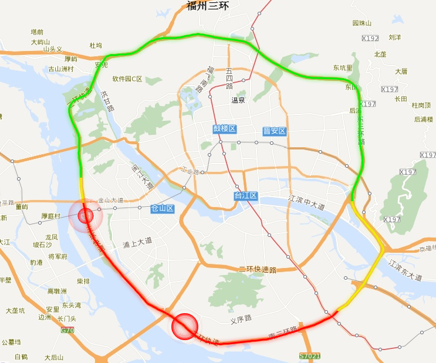

## bampar包是干什么的
bamapr=baidu map API+ amap API,试图提供百度地图和高德地图API的数据抓取和呈现。

## bampar包目前有什么功能
  - 批量抓取POI信息（如公交站点）
  - 批量抓取公交路线
  - 批量抓取路网信息（以福鼎为例）
  - 批量抓取拥堵情况
  - 叠加事故标志
  - 叠加施工标志
  - OD对期望图
  
## bamapr的一些展示

```{r setup, include=FALSE}
knitr::opts_chunk$set(echo = F,warning = F,fig.align='center')
library(REmap)
library(bamapr)
library(wordcloud2)
library(flexdashboard)
```

### 公交站点


### 公交路线


### 批量抓取路网信息


### 叠加事故标志


### 叠加施工标志


### OD对期望图


## 应用场景
- 公交专项规划
- 选址规划
- 叠加实时公交信息的公交到达率分析
- 各个时段Top10拥堵路段
- 标定城市交通仿真模型参数
- 反向校核道路修建、改造后的效果
- 出行服务
- 基于百度热力图的重庆职住研究 <http://www.udparty.com/topic/1568.html/>
- 其他.....

## 下一步工作
- 完善功能：抓取拥堵路段的经纬度信息（50%）
- 完善功能：完善路网连通性
- 完善功能：导入CAD道路平面成果
- 数据挖掘......
